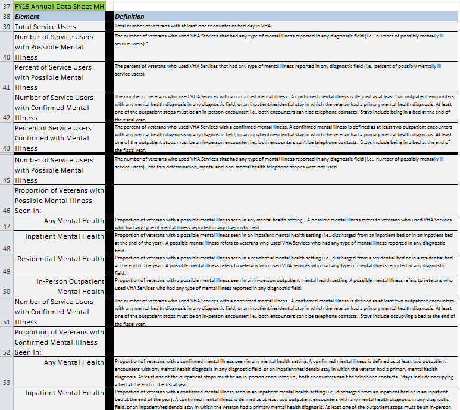

# Introduction

Around April 2016, the Department of Veterans Affairs released a [dataset of medical center-level mental health statistics covering fiscal year 2015.](http://catalog.data.gov/dataset/va-national-mental-health-statistics-2015) These statistics aim to shed light on the prevalence, mental health utilization, non-mental health utilization, mental health workload, and psychological testing of Veterans with a possible or confirmed diagnosis of mental illness. These data are 
prepared by the [VA Northeast Program Evaluation Center (NEPEC)](http://www.ptsd.va.gov/PTSD/about/divisions/evaluation/index.asp) which the organization responsible for evaluating VA's mental health programs. 

The Mental Health Explorer is a simple application that allows anyone to pick a mental health measure and view the values for all the VA facilities that were rated for that measure. The application will show a histogram showing the distribution of measure values and provide a sortable/searchable table of facilities. 

# Data description

The [FY15 mental health annual datasheet](https://github.com/department-of-veterans-affairs/NEPEC_AnnualDataSheet_MH_FY15) is provided in JSON format via GitHub. There are 5,182 observations in this dataset and it consists of five variables: Category, Item, Station, Value, and ValueType. All of these variables are read-in as character types including the *Value* field which has % signs for some observations. 

[There is also data dictionary](https://github.com/department-of-veterans-affairs/NepecPtsdDataDictionary) on GitHub that gives an overview of NEPEC, defines these variables and the values they assume, along with a look-up table to link facility station numbers to their names. The data dictionary is tricky to use because it encompasses multiple datasets, of inconsistent and undefined terminology, and is structured in a way that is counter to being machine readable. In order to easily pull-in the useful bits of the data dictionary into the Shiny application I had to manually re-create parts of the data dictionary (NepecPtsdDataDictionary-Edit.csv). These steps are outlined below in as much detail as possible. I have also included the original data dictionary (NepecPtsdDataDictionary.xlsx) in this repository for the sake of posterity. 

# Program files 

There are two programs in this repository, one file is the Shiny application and the second is the data preparation program which creates the dataset for the application. The Shiny application program is simply named *app.R*. 

The data preparation program is named *Code_Data_Prep.R*. This program reads the source json file directly from [catalog.data.gov](http://catalog.data.gov) or locally assuming you've downloaded it yourself either from the site or through this repo. The results of the data preparation program are two datasets: Data_Mental_Post.rds and Data_MeasureDefs.rds. The reason for saving them as *.rds is because the format results in a much smaller size and also because I didn't think it made sense to incorporate that logic in the application. Doing that would have meant that each time someone launched the application each preparation step would execute. 

# Using the application

This application can be used online by visiting https://mihiriyer.shinyapps.io/MentalHealth/

Alternatively, you run the application locally in RStudio by executing the following command in the console window:

`shiny::runGitHub(repo = 'mihiriyer/mental')`

# Data preparation steps 

1. Created a custom data dictionary to pull-in definitions into the Shiny application. All of the issues in the data dictionary and the remediation steps are described in detail below:

  + The *Item* field in the dataset contains each measure, however, the data dictionary the term *Element* is used. These have been linked in the custom data dictionary.
  + Some of the *Elements* are grouped under a heading in the data dictionary. The verbiage of these headings is fused with the *Element* verbiage in the Item field of the dataset. For example, in the image below, on row 46 you can see the heading *Proportion of Veterans with Possible Mental Illness Seen in:*. Under this heading there are five *Elements*, however, in the dataset in the *Item* field you will see *Proportion of Veterans with Possible Mental Illness Seen in Any Mental Health*. To address this issue I had manually concatenated these terms so that I could link the *Item* values to its corresponding definitions. In the edited data dictionary I called the *Element* headings *ItemPrefix*.
 
 

 
 
  + Relationship between *Category* and *Item* is not described in the data dictionary nor are the *Category* values defined. I dealt with this by extracting the unique *Category-Item* combinations from the dataset and added them to the data dictionary. I did not attempt to get *Category* definitions. 

  + In the above image you will also notice that there is a blank column (colored black) and a blank cell next to each *Element* heading. These were obviously not replicated in the custom data dictionary. 

  + **Recap** - The custom data dictionary maps the following relationship: Item (dataset) - Category (dataset) - ItemPrefix (dictionary) - Element (dictionary) - Definition (dictionary)

2. Added *VISN* and *Station.Name* to the mental health dataset.

3. Removed % sign from *Value* field and converted to numeric data type.

4. Save dataset as *.rds for Shiny application. 
